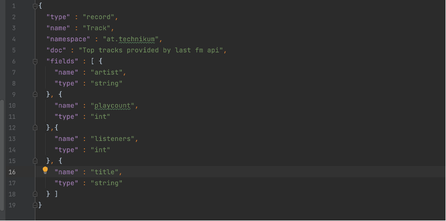
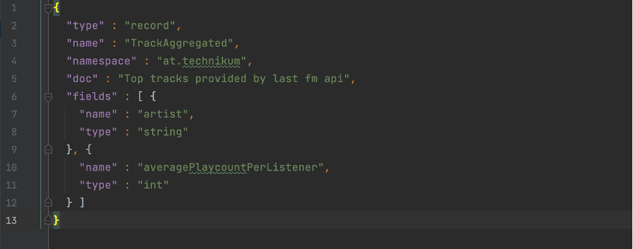

# Streams
Kafka wurde auf Confluent umgestellt, da diese Images bereitstellen, mit welchen eine Implementierung bewerkstelligt werden kann. 
Wir haben zwei Schematas erstellt, aus welchen mit Hilfe von Avro Klassen generiert werden.

Schema 1 generiert die Klasse Track.java:

Schema 2 generiert die Klasse TrackAggregated.java:

## Compatibility
Als Schema Kompatibilität wurde Backward gewählt, da dies die Kafka-Streams unterstützt. Demnach können Consumer nur Daten
des Schemas lesen, welche Producer geschrieben haben. Für das Schema heißt dies, dass keine Felder hinzugefügt werden können 
(nur optional). Andererseits können Felder gelöscht werden.

Weitere Möglichkeiten:

